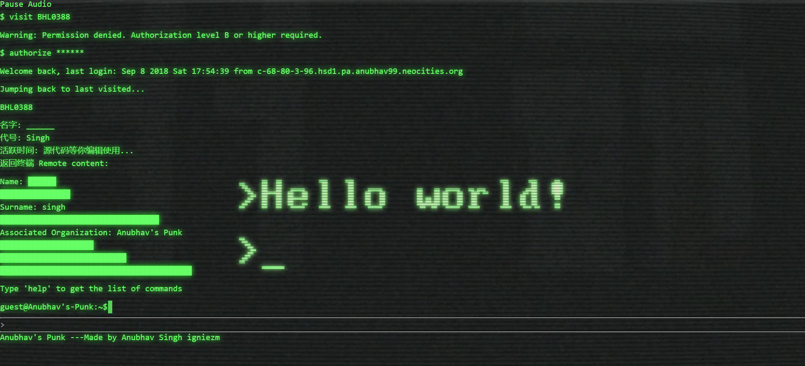
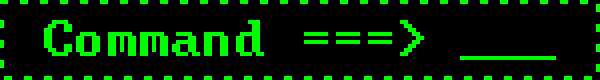

# 🚀 Anubhav's Punk: The Future of Blogging at Your Fingertips 🚀

Welcome to **Anubhav's Punk**, a cutting-edge, sci-fi themed terminal for browsing my out-of-this-world blog! Step into the future with a sleek, command-based interface powered by HTML, CSS, JavaScript, and Tailwind CSS, seamlessly integrated with the Terminal CSS framework. We're tapping into the Backendless APIs to deliver a mind-blowing, interactive experience straight from the 22nd century.

## 👾 Features

- **🛸 Sci-Fi Themed Interface**: Dive into a futuristic environment that's so immersive, you'll think you were abducted by aliens.
- **💻 Command-Based Navigation**: Use cool terminal commands to explore blog posts and interact with the interface like a true cyberpunk.
- **🤖 Backendless Integration**: Fetch and display blog data dynamically using Backendless APIs. Because static is so last century.
- **📱 Responsive Design**: Enjoy a flawless experience whether you're on a spaceship or your grandma's old desktop.

## 🧑‍🚀 Commands

The terminal supports the following commands (specially designed for maximum sci-fi flair):

- `start       - Kick things off, because why not?`
- `explore     - Just in case you didn't like the first start`
- `help        - I'll tell you everything I know... which isn't much`
- `who am i    - Identity crisis? Let's figure out who you are!`
- `social      - Stalk me online (social media links)`
- `blogs       - Pretend to read my blog (links included)`
- `all commands- Spoiler alert: It's this list`
- `clear       - Magic trick! Watch the terminal disappear`
- `list        - Lists all blog posts. Consider it your galactic directory`
- `view <post_id> - View the content of a specific blog post. Beam it directly to your screen`
- `about       - Information about the author and the terminal. Spoiler: It’s all about me and this amazing terminal`


## 🛠️ Technologies Used

- **Frontend**:
  - HTML (HyperText Martian Language)
  - CSS (Cyber Styling Sheets)
  - JavaScript (Alien-powered Scripts)
  - Tailwind CSS (Because even the future needs good design)
  - Terminal CSS (Retro-futuristic terminal vibes)

- **Backend**:
  - Backendless API (No servers were harmed in the making of this project)

## 🚀 Getting Started

Follow these steps to set up and launch your personal gateway to the future.

### 🖥️ Prerequisites

- Node.js and npm installed (Because even the future relies on these classics)

### 🛸 Installation

1. Clone the repository
    ```bash
    git clone https://github.com/AnubhavSingh99/Anubhav-s-Punk.git
    cd Anubhav-s-Punk
    ```

2. Install dependencies
    ```bash
    npm install
    ```

3. Start the development server
    ```bash
    npm start
    ```

4. Open your browser and navigate to `http://localhost:3000` (Your personal sci-fi terminal awaits)

## 🪐 Usage

Once you've set up the project, use the terminal interface to navigate through blog posts with the commands mentioned above. Feel the power of the future at your fingertips.

## 📸 Screenshots



## 🎬 Demo Video

For a quick walkthrough of the project, check out this demo video:

[](https://www.youtube.com/watch?v=H8LYB0x2jzk)


## 🌌 Contributing

Got an idea for an upgrade or found a bug? Contributions are welcome! Open an issue or submit a pull request to help us make this terminal even more futuristic.

## 📜 License

This project is licensed under the MIT License. See the [LICENSE](LICENSE) file for more details.

## 📬 Contact

For any questions or feedback, send me a holographic message at [singhanubhav7456@gmail.com] (just kidding, a regular email will do).

---

Thank you for exploring Anubhav's Punk. Enjoy navigating the cosmos of my blogs in this unique, sci-fi terminal experience! May the source be with you! 🚀✨
